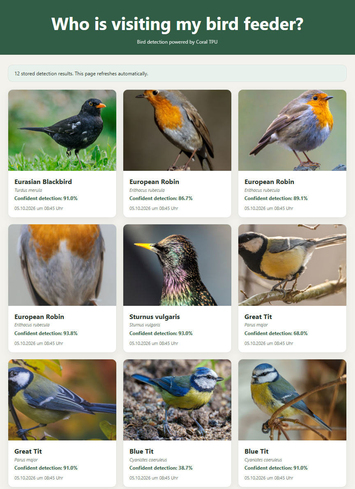

TL:DR Lightweight bird feeder monitoring system powered by Google Coral TPU. Captures RTSP camera snapshots, detects birds, classifies species, stores observations as JSON records, and provides a simple Flask-based web interface for browsing bird visitors and image crops.

# Birdfeeder

Lightweight bird feeder monitoring powered by Google Coral TPU.

Birdfeeder captures images from an RTSP camera, detects birds using a Coral Edge TPU, classifies bird species, stores observations as JSON records, and presents the results through a lightweight Flask web interface.

The project follows a strong KISS (Keep It Simple, Stupid) philosophy and was created as a lightweight alternative to more complex bird-monitoring stacks.

---

## Birdfeeder Web Interface

A lightweight local web interface showing detected birds, confidence scores, translated species names and cropped observations.



---

## Features

- RTSP camera integration
- Coral TPU accelerated object detection
- Bird species classification
- Automatic crop generation
- JSON-based observation history
- Lightweight Flask web interface
- Multi-language user interface (English / German)
- Localized bird names
- Scientific bird names
- Intelligent fallback to scientific names
- Background classification suggestions
- Docker-based deployment
- No database required
- Low resource consumption
- Fully self-hosted

---

## Architecture

```text
RTSP Camera
    │
    ▼
Birdfeeder
    │
    ▼
CoralAPI
    │
    ▼
Google Coral Edge TPU

Birdfeeder
    │
    ▼
JSON History + Image Crops
    │
    ▼
Flask Web Interface
```

---

## Requirements

### Hardware

- RTSP-compatible IP camera
- Google Coral Edge TPU (USB, PCIe or M.2)
- Linux host

### Software

- Docker
- Docker Compose
- CoralAPI
- Python 3.12 (for local development)

---

## Quick Start

Configurable options include:

- Camera URL
- CoralAPI endpoint
- Detection threshold
- Retention settings
- Interface language (`LANGUAGE=de|en`)

Clone the repository:

```bash
git clone git@github.com:MichaelWeissenberg/birdfeeder.git

cd birdfeeder
```

Create a local configuration:

```bash
cp .env.example .env
```

Adjust camera and CoralAPI settings:

```bash
nano .env
```

Build and start the services:

```bash
docker compose build birdfeeder

docker compose up -d
```

Open the web interface:

```text
http://SERVER-IP:8080
```

---

## Documentation

Detailed documentation is available in the `docs` directory.

| Document | Description |
|-----------|-------------|
| CAMERAS.md | RTSP camera configuration and examples |
| CORAL.md | Coral TPU and CoralAPI integration |
| DEPLOYMENT.md | Installation, deployment and maintenance |

---

## Design Philosophy

Birdfeeder intentionally avoids unnecessary complexity.

Goals:

- Self-hosted
- Lightweight
- Easy to understand
- Easy to maintain
- Few dependencies
- No database requirement
- Human-readable JSON data

The project replaces a significantly more complex setup consisting of:

- Frigate
- WhoIsAtMyFeeder sidecar
- go2rtc
- WatchMyBirds

while keeping the functionality required for bird feeder monitoring.

---

## Roadmap

### Observation Management

- Configurable retention policy
- Default retention of 90 days
- Delete observations from the web interface
- Delete all observations from the web interface

### Analytics

- Observation statistics
- Storage usage information

### User Interface

- Enhanced gallery view

---

## AI Usage Notice

> This project was initially bootstrapped using AI-assisted tools ("vibe coding") and subsequently reviewed, refactored, tested, and documented manually to ensure maintainability, transparency, and operational reliability.

---

## License

This project is licensed under the GNU General Public License v3.0 (GPL-3.0).

You are free to use, modify and redistribute this software under the terms
of the GPL.

See the LICENSE file for details.

---
